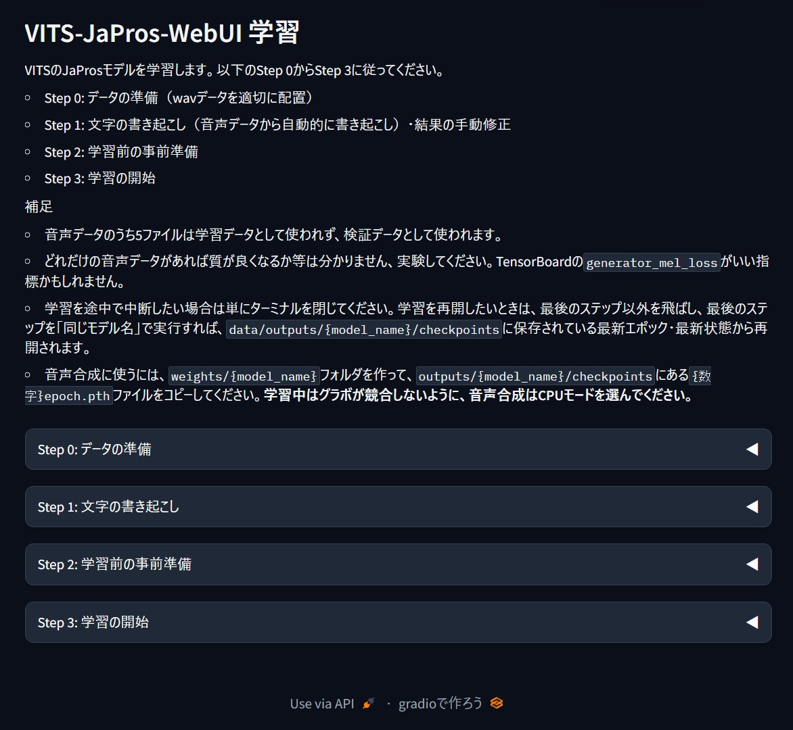

# VITS-JaPros-WebUI

日本語VITSモデルを学習でき、アクセント指定込みで音声合成できる、Windows用WebUIです。

[🤗 音声合成のデモ](https://huggingface.co/spaces/litagin/vits-japros-webui-demo)

|音声合成|学習|
|:---:|:---:|
|||

## JaPros?

- 機械学習での音声処理タスクをいろいろ統一的に扱える[ESPnet](https://github.com/espnet/espnet)という枠組みがある。
- ESPnetでのTTS学習の方法として[VITS](https://arxiv.org/abs/2106.06103)が使える。
- ESPnetではTTS学習の際、学習テキスト（日本語文）から音素列へ変換する方法(*g2p*)を指定でき、その中の一つにアクセント記号を付加した`pyopenjtalk_prosody`がある。

という状況で、**日本語でg2pを`pyopenjtalk_prosody`にして訓練したモデル**のことを、JApanese ..._PROSodyから取って**JaPros**と便宜上読んでいます（Bingちゃんからの提案）。

pyopenjtalk_prosodyではアクセント等の記号も扱われているので、それを使ってアクセント（`ハ➚シ` v.s. `ハ➘シ`等）が制御できます。

<details>
<summary>アクセント記号詳細</summary>

| 記号 | 役割 | 例 |
| --- | --- | --- |
| `[` | ここからアクセントが上昇（➚のイメージ） | こんにちは → `コ[ンニチワ` |
| `]` | ここからアクセントが下降（➘のイメージ） | 京都 → `キョ]オト` |
| ` `（半角スペース） | アクセント句（何となくひとまとまりの箇所）の切れ目 | `ソ[レワ ム[ズカシ]イ` |
| `、` | ポーズ（息継ぎ）。短いポーズを入れたいときに使います。 | `ハ]イ、ソ[オ オ[モイマ]ス` |
| `?` | 疑問文の終わりにつけます。 | `キ[ミワ ダ]レ?` |
</details>

## これは何?

これは、Windowsローカル環境でVITS JaProsモデルを学習したり、読み込んで音声合成できるやつです。

### 学習について

- [faster-whisper](https://github.com/guillaumekln/faster-whisper)による、音声ファイルからの自動書き起こし機能つき
- 学習自体は[ESPnet](https://github.com/espnet/espnet)をWindowsで動くように改造して、VITS JaProsを最低限の操作で学習できるようにしたもの

### 音声合成について

- カタカナと記号による（たぶん）ある程度直感的なアクセント制御
- 簡易的な話速・ピッチ・抑揚調整機能（pyworld由来）
- CPUでも動く（学習の最中に別で立ち上げてチェック可能）
- これを使って作られたモデルでなくても、ESPnetでVITSでpyopenjtalk_prosodyなモデルなら、`config.yaml`と一緒に入れれば動くはず

## 使い方

### インストール

Python 3.10でWindows 11でRTX 4070で動作確認しました。

1. まずこのリポジトリをクローンしてください。
```sh
git clone https://github.com/litagin02/vits-japros-webui.git
```

2. 中にある`setup.bat` をダブルクリックして、しばらく待ってください。`Setup complete.`と表示されたら完了です。

### 使い方

- 学習：`webui_train.bat`をダブルクリック
- 音声合成：下を参照して`pth`ファイルを配置してから`webui_infer.bat`をダブルクリック
- アップデート: `update.bat`をダブルクリック

詳しい情報・WebUIがいらない方は[こちら](docs/CLI.md)をご覧ください。

### 音声合成のためにモデルを置く

モデルは`weights`ディレクトリにサブディレクトリを作って、その中に`{数字}epoch.pth`ファイルを入れてください。
外部モデル（ESPnetでVITSでpyopenjtalk_prosodyで作ったモデルのみ対応）を使う場合は、学習時の`config.yaml`も入れてください。

```
weights
├── model1
│    └── 100epoch.pth
|── model2
│    ├── 50epoch.pth
│    └── config.yaml
...
```

## クレジット
- [ESPnet](https://github.com/espnet/espnet): このリポジトリでは、オリジナルのESPnetのPythonモジュールをWindowsで動くように改造して使っています（改造箇所は`os.uname`の使用箇所とシンボリックリンク作成箇所のみです）。
